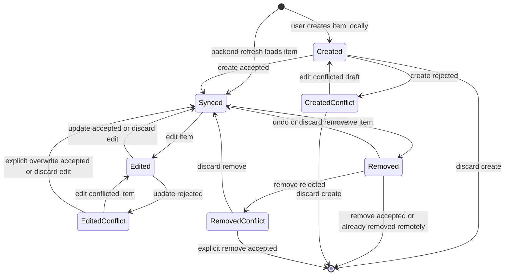
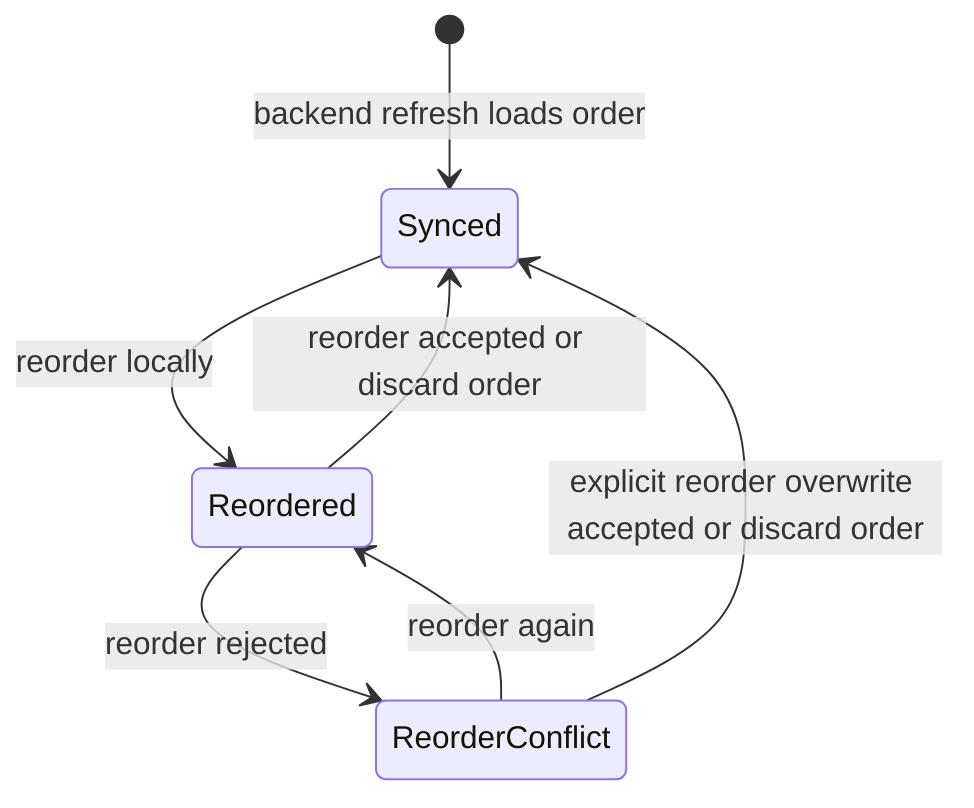

# Local-First Entity State Machines

Canonical lifecycle state machines for repository-owned local entities. These patterns apply to all sync-capable aggregates: songs, plans, sessions, and session items.

See [domain-vocabulary.md](../domain/domain-vocabulary.md) for term definitions.

## Dimensions

Entity state describes the durable state of a known local record or local ordering intent. It does not include records absent from the local authenticated cache.

Three orthogonal dimensions exist alongside entity state:

- `sync_activity`: idle or running
- `connectivity`: online, offline, or unknown
- `freshness`: fresh, stale, or offline_cached

Syncing is transient activity over one or more durable local states. Retryable network, timeout, or temporary backend failures do not change entity state — they remain sync metadata on the current pending local state.

## Item Lifecycle

Applies to user-visible records that can be created locally, loaded from backend refresh, edited, removed, and recovered through intent-specific conflict states.

### States

- `Created`: a new locally-created item that has not been accepted by the backend. Appears in normal UI with pending status.
- `Synced`: a local copy of a backend-accepted item state. May be stale; this state only means there is no known local divergence.
- `Edited`: a previously backend-accepted item with local edits that have not been accepted by the backend. Edited version appears in normal UI with pending status.
- `Removed`: a local remove intent. Item is hidden from normal UI, but the record may remain visible in sync or recovery surfaces until backend acceptance or discard.
- `CreatedConflict`: a created item is blocked by a non-retryable create rejection.
- `EditedConflict`: an edited item is blocked by update rejection (version conflict, authorization denial, remote deletion, or another non-retryable backend rejection).
- `RemovedConflict`: a local remove intent is blocked by remove rejection (version conflict, authorization denial, dependency blocking, or another non-retryable backend rejection).

### Transitions

### Same-State Events (Omitted From Diagram)

- Editing a `Created` draft keeps it `Created`.
- Editing an `Edited` item before backend acceptance keeps it `Edited`.
- Rejected explicit overwrite keeps an `EditedConflict` in `EditedConflict`.
- Rejected explicit remove keeps a `RemovedConflict` in `RemovedConflict`.

### Discard Actions

- `discard create`: the local created record is removed from the authenticated cache.
- `discard edit`: the local edited version is replaced by the backend-accepted or restored canonical local state.
- `discard remove`: the local remove intent is cleared, the item returns to `Synced`, and the item becomes visible in normal UI again.

### Conflict Recovery Rules

- **Create conflicts**: resolved by editing the conflicted draft into a new `Created` intent or discarding the local create. No explicit overwrite path exists for create conflicts because no backend-accepted item exists yet.
- **Edit conflicts**: resolved by editing the conflicted item into a new `Edited` intent, discarding the edit, or using an explicit backend-authorized overwrite path. The item only returns to `Synced` through explicit overwrite after the backend accepts that overwrite.
- **Remove conflicts**: resolved by discarding the remove intent or using an explicit backend-authorized remove path. The record only leaves local state after the backend accepts the explicit remove.

## Reorder Lifecycle

Applies to sibling collection ordering, not item editing. Reorder is a local intent over a collection such as sessions within one plan or session items within one session.

### States

- `Synced`: the local order reflects a backend-accepted order.
- `Reordered`: a local order intent exists and has not been accepted by the backend.
- `ReorderConflict`: a local order intent is blocked by reorder rejection (base-order conflict, authorization denial, changed sibling set, or another non-retryable backend rejection).

### Transitions

### Reorder Overwrite Rule

The local order wins for siblings known to the local reorder intent. Backend siblings not present in the local reorder intent are preserved and appended deterministically. Reorder overwrite must not delete siblings; deletion requires a separate remove intent.

## Entity Mapping

### Song

Songs use the item lifecycle pattern.

- `Created` songs appear in normal song UI with pending status.
- `Edited` songs show the local edited version in normal song UI with pending status.
- `Removed` songs are hidden from normal song lists, route lookup, and reader surfaces.
- `CreatedConflict` may represent backend validation, authorization, slug/title collision, or another non-retryable create rejection.
- Songs with update-sourced remote deletion (`song_not_found` during update sync) enter `EditedConflict` with durable remote-deletion classification. `keep mine` recreates the canonical song via same-id backend recreation; `discard mine` accepts deletion as canonical truth.
- Delete-sourced remote deletion auto-converges as accepted deletion.

### Plan

Plans use the item lifecycle pattern. Plans also own a reorder lifecycle for their session order.

- `Removed` plan means local intent to delete the plan and its full hierarchy.
- Backend-accepted plan delete removes the plan, its sessions, and its session items.
- Plan session order uses the reorder lifecycle pattern representing ordering of sessions within one plan.

### Session

Sessions use the item lifecycle pattern. Sessions also own a reorder lifecycle for their session item order.

- Session create, rename, and delete map to `Created`, `Edited`, and `Removed`.
- Session item order uses the reorder lifecycle pattern representing ordering of session items within one session.
- Session delete is allowed only for locally empty sessions; backend re-checks the invariant before accepting.

### Session Item

Session items use the item lifecycle pattern for add-song and remove-song intent.

- Adding a song to a session maps to `Created`.
- Removing a song from a session maps to `Removed`.
- There is no `Edited` branch for session items in the current product model because session items do not yet have editable user-facing fields.

## Cross-Domain Reference Rules

When a canonical song row is deleted while planning references still exist:

- Planning-owned preserved titles remain the durable reference source for session items whose canonical song row is gone.
- Plan detail must continue to render the preserved planning title rather than collapsing to a raw missing-id or generic not-found placeholder.
- Session-scoped reader routes must show a tombstone-style deleted-song surface using preserved planning reference data rather than a generic `SongNotFoundException`.
- Tombstone minimum contract: visible preserved title, visible deleted/unavailable label, no bare `songId`, no edit affordance.
- Planning-owned preserved title is source of truth for tombstone copy until a later planning refresh supplies a new canonical row.
