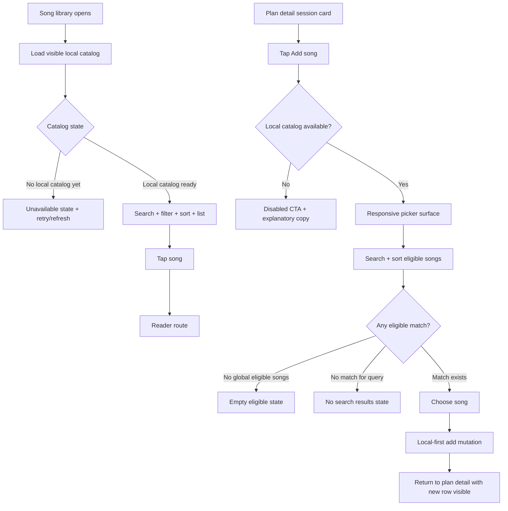

# Song List And Plan Song Pick UX Discovery

> Status: Draft

> This discovery artifact remains low-fidelity design input. Canonical shipped behavior for this slice lives in `docs/specs/2026-04-19-song-list-plan-song-pick-ux.md` and `docs/plans/2026-04-19-song-list-plan-song-pick-ux.md`.

## Purpose

Capture the minimum UX decisions needed before implementation planning for two adjacent but different flows:

- browsing the song library
- picking a song into a plan session

This discovery artifact is intentionally low fidelity. It exists to lock interaction direction, state boundaries, and scope without turning the current slice into a visual redesign project.

Companion prototype:

- `docs/prototypes/song-list-plan-picker-mockup.html`

## Current UX Snapshot

### Song Library Browse

- One flat title-only list.
- No search field.
- No explicit filter control.
- Sort is fixed to title ascending because the local catalog store returns `SongSummary` values sorted by `title`.
- Empty, loading, refresh-failed, offline-cached, and unavailable states already exist.
- Primary actions currently share the app bar: refresh, add song, planning entry, sign out.

### Plan Session Song Pick

- Session card exposes `Add song`.
- Picker is a simple `AlertDialog` containing a static list of selectable songs.
- Songs already present in the session are removed from the picker before render.
- No search field.
- No explicit sort control.
- No explicit empty state for "all visible songs already used in this session".
- Add is disabled entirely when no local cached catalog exists.

## UX Direction

### Shared Principle

Both flows read from the same active-organization local song catalog, but they solve different jobs:

- song library = browse, inspect, and navigate
- plan picker = decide fast, avoid duplicates, stay in planning context

Do not force the picker to behave like a mini song library screen. Reuse vocabulary and list patterns, not full information architecture.

### Shared Interaction Vocabulary

- same search field label and placeholder language
- same list row core content: song title first
- same status copy tone for loading, empty, offline, and retryable failure
- same sort labels where the same options exist

## Low-Fi Flow



## Wireframes

### Song Library

```text
+--------------------------------------------------------------+
| Lyron Chords                            Refresh  Add  Plans  |
+--------------------------------------------------------------+
| [status surface: online / offline / refreshing / failed]     |
| [search songs.............................................]   |
| [All] [Pending sync] [Conflicts]                             |
|--------------------------------------------------------------|
| Song title A                                            >    |
| Song title B                                            >    |
| Song title C                                            >    |
| ...                                                          |
+--------------------------------------------------------------+
```

### Plan Song Picker, Wide

```text
+------------------------------------------------------+
| Add song to session                                  |
| [search songs....................................]   |
| [Eligible songs]                                    |
|------------------------------------------------------|
| Song title A                                    Add  |
| Song title B                                    Add  |
| Song title C                                    Add  |
| ...                                                  |
|------------------------------------------------------|
| Cancel                                               |
+------------------------------------------------------+
```

### Plan Song Picker, Narrow

```text
+------------------------------------------------------+
| < Back                     Add song                  |
| [search songs....................................]   |
| [Eligible songs]                                    |
|------------------------------------------------------|
| Song title A                                    Add  |
| Song title B                                    Add  |
| Song title C                                    Add  |
| ...                                                  |
+------------------------------------------------------+
```

## Interaction Notes

### Song Library

- Search sits above the list, below the persistent status surface.
- Filter is intentionally narrow in this slice:
  - `All`
  - `Pending sync`
  - `Conflicts`
- Sort is intentionally narrow in this slice:
  - `Title (A-Z)` default
  - do not add a visible sort control unless implementation can support at least one second clean local option without widening this UX slice into metadata redesign
- Empty states split into:
  - no local catalog yet
  - no songs in catalog
  - no matches for current search/filter

### Plan Song Picker

- Picker defaults to session-eligible songs only.
- Songs already present in the target session are excluded before search results render.
- Search is local, immediate, and starts from the first keystroke.
- Sort should stay minimal:
  - `Title (A-Z)` default
  - no visible picker sort control unless a second clean shared option exists
- Picker should use:
  - dialog on wider layouts
  - full-screen sheet/page on narrow layouts
- Confirmation is single-tap on a song row or trailing add action; no secondary confirmation dialog.

## State Decisions

### Persistence

- Song-library search/filter/sort state should survive route-internal rebuilds and back navigation from the reader during the same app session.
- Song-library search/filter/sort state does not need restart persistence in this slice.
- Picker search/sort state is ephemeral and resets each time the picker closes.

### Empty And Failure States

- "No local catalog yet" remains a blocking state for picker eligibility.
- "All visible songs already in this session" needs dedicated picker copy, not generic empty copy.
- "No search results" must be distinct from "nothing eligible to add".
- Loading should keep layout stable instead of replacing the whole picker with jittery height changes.

## Accessibility And Input Notes

- Keep existing icon-button tooltips and extend the pattern to new controls.
- Search field must have explicit label text, not placeholder-only semantics.
- Keyboard traversal order must be search -> filter -> sort -> results.
- On narrow touch layouts, picker controls must remain reachable without requiring hover.
- Escape/back closes picker; Enter on a focused result adds the song.

## Decisions Carried Into Spec

- Separate browse flow and picker flow, shared vocabulary only where helpful.
- Add local search to both flows.
- Keep filters and sorting intentionally small.
- Use responsive picker presentation instead of one fixed dialog size.
- Add explicit empty-state taxonomy for unavailable, empty, and no-match cases.
- Keep persistence lightweight and route-scoped, not restart-durable.
