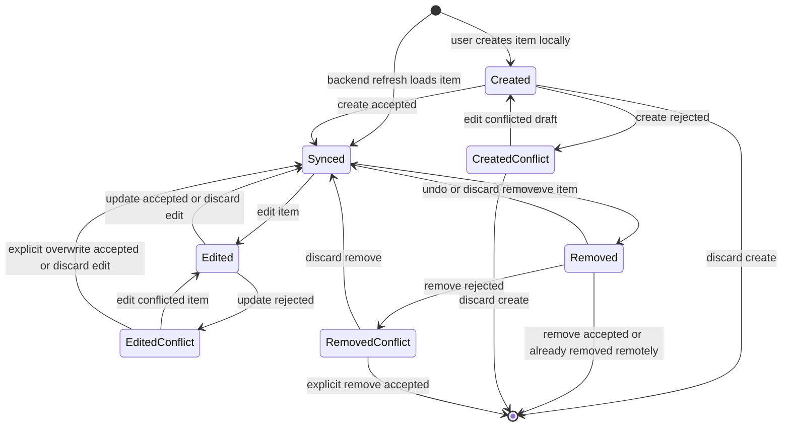
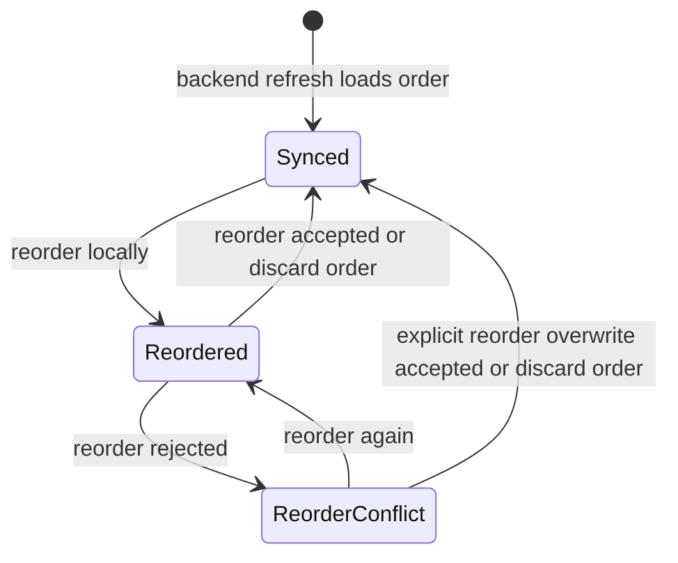

# Online-Preferred Local-First Sync Contract

> Status: Draft

## Goal

Define the product and architecture contract for Lyron's sync behavior before the next implementation work: the app should prefer fresh online data when available while preserving local-first guarantees whenever connectivity is missing, unstable, or recovering.

## Problem

The repository already contains several local-first capabilities:

- song reads use a cached authenticated catalog with online refresh
- song create, edit, delete, conflict handling, and manual sync are persisted locally first
- planning reads use a synchronized local projection
- planning writes use a separate persisted mutation store overlaid on top of the local projection
- sign-out warns before discarding unsynced song or planning mutations

The user-facing contract is not yet stated in one place. Some surfaces feel fully offline-first, while others behave as online refresh with offline fallback. That can create unclear expectations around freshness, pending local work, reconnect behavior, manual sync, and future realtime subscriptions.

## Product Contract

Lyron should be **online-preferred, offline-safe, local-first**.

This means:

- Online availability should improve freshness and collaboration without becoming required for core preparation work.
- UI reads should continue to come from repository-owned local projections or merged local views, not directly from transient realtime events.
- Local writes should remain durable across app restart until accepted, discarded, or explicitly cleared by sign-out.
- Offline status must not imply data loss or disabled preparation workflows when the required local state already exists.
- Sync and refresh failures should preserve the last usable local state.
- The UI must distinguish "saved locally" from "accepted by the backend" where that distinction matters.
- Backend authorization remains authoritative for every canonical write acceptance.
- Explicit sign-out remains a destructive authenticated-cache boundary and must continue warning when unsynced work exists.

## Vocabulary

Use these terms consistently in specs, UI copy, models, and tests:

- `fresh`: local projection was refreshed from the backend in the current online context.
- `stale`: local projection is usable, but the app could not confirm current backend freshness.
- `offline_cached`: local projection is usable while connectivity or backend reachability is unavailable.
- `refreshing`: the app is attempting to update the local projection from the backend.
- `pending_local`: local mutation exists and has not yet been accepted by the backend.
- `syncing`: pending local mutations are being sent to backend-authorized write contracts.
- `sync_failed`: a retryable sync attempt failed and local intent remains durable.
- `conflict`: backend state and local intent diverged and require explicit user choice.
- `authorization_denied`: backend rejected a mutation because the user lacks the required capability.
- `dependency_blocked`: backend or local policy rejected a mutation because related data prevents it.

## Freshness And Sync Triggers

The app should eventually converge through multiple triggers:

- initial signed-in active-organization resolution
- app foreground/resume
- offline-to-online transition
- explicit manual sync
- existing periodic refresh where already implemented
- future backend change subscription events

These triggers should call repository/application refresh and sync paths. They must not bypass repository-owned local projection replacement, mutation ordering, backend authorization, or conflict classification.

## Realtime Subscription Direction

Backend subscriptions are allowed as an online freshness optimization, but not as the UI data source.

Subscription events should be treated as invalidation signals:

1. receive a relevant song or planning change event
2. debounce or coalesce events by active organization
3. run the existing backend-authorized refresh path
4. replace the local projection only after a complete accepted refresh
5. preserve the previous local projection on refresh failure

If events are missed, reconnect, foreground refresh, periodic refresh, and manual sync must still converge the app.

## Manual Sync Contract

A visible manual sync action should eventually mean "sync my local work and refresh my current workspace" rather than "refresh only this list."

The unified manual sync implementation should:

- sync pending song mutations for the active authenticated organization
- sync pending planning mutations for the active authenticated organization
- refresh song catalog data after song sync attempts
- refresh planning projections after planning sync attempts
- leave domain-specific recovery actions visible for conflicts, authorization denials, and dependency-blocked mutations
- avoid hiding failed or conflicted work behind a single generic error state

## Generic Local Lifecycle Patterns

Entity state in this contract means the durable state of a known local record or local ordering intent. It does not include records that are not present in the local authenticated cache.

Sync activity, connectivity, and freshness are separate dimensions:

- `sync_activity`: idle or running
- `connectivity`: online, offline, or unknown
- `freshness`: fresh, stale, or offline cached

Syncing is not an entity lifecycle state. It is transient activity over one or more durable local states.

Retryable network, timeout, or temporary backend failures do not change entity state. They remain sync metadata on the current pending local state.

### Item Lifecycle Pattern

The item lifecycle applies to user-visible records that can be created locally, loaded from backend refresh, edited, removed, and recovered through intent-specific conflict states.

Generic item states:

- `Created`: a new locally-created item that has not been accepted by the backend. It appears in normal UI with pending status unless entity-specific rules say otherwise.
- `Synced`: a local copy of a backend-accepted item state. It may be stale; the state only means there is no known local divergence.
- `Edited`: a previously backend-accepted item with local edits that have not been accepted by the backend. The edited version appears in normal UI with pending status.
- `Removed`: a local remove intent. The item is hidden from normal UI, but the record may remain visible in sync or recovery surfaces until backend acceptance or discard.
- `CreatedConflict`: a created item is blocked by a non-retryable create rejection. Exact rejection reasons can stay entity-specific.
- `EditedConflict`: an edited item is blocked by update rejection, such as version conflict, authorization denial, remote deletion, or another non-retryable backend rejection.
- `RemovedConflict`: a local remove intent is blocked by remove rejection, such as version conflict, authorization denial, dependency blocking, or another non-retryable backend rejection.

Same-state events are intentionally omitted from the diagram:

- editing a `Created` draft keeps it `Created`
- editing an `Edited` item before backend acceptance keeps it `Edited`
- rejected explicit overwrite keeps an `EditedConflict` in `EditedConflict`
- rejected explicit remove keeps a `RemovedConflict` in `RemovedConflict`

Generic discard actions are intent-specific:

- `discard create`: the local created record is removed from the authenticated cache.
- `discard edit`: the local edited version is replaced by the backend-accepted or restored canonical local state.
- `discard remove`: the local remove intent is cleared, the item returns to `Synced`, and the item becomes visible in normal UI again.

Generic conflict recovery rules:

- Create conflicts are resolved by editing the conflicted draft into a new `Created` intent or discarding the local create. There is no explicit overwrite path for create conflicts because no backend-accepted item exists yet.
- Edit conflicts may be resolved by editing the conflicted item into a new `Edited` intent, discarding the edit, or using an explicit backend-authorized overwrite path. The item only returns to `Synced` through explicit overwrite after the backend accepts that overwrite.
- Remove conflicts may be resolved by discarding the remove intent or using an explicit backend-authorized remove path. The record only leaves local state after the backend accepts the explicit remove.

### Reorder Lifecycle Pattern

The reorder lifecycle applies to sibling collection ordering, not item editing. Reorder is a local intent over a collection such as sessions within one plan or session items within one session.

Generic reorder states:

- `Synced`: the local order reflects a backend-accepted order.
- `Reordered`: a local order intent exists and has not been accepted by the backend.
- `ReorderConflict`: a local order intent is blocked by reorder rejection, such as base-order conflict, authorization denial, changed sibling set, or another non-retryable backend rejection.

Reorder overwrite rule:

The local order wins for siblings known to the local reorder intent. Backend siblings not present in the local reorder intent are preserved and appended deterministically. Reorder overwrite must not delete siblings; deletion requires a separate remove intent.

## Entity Mapping

### Song

Songs use the item lifecycle pattern.

Song-specific rules:

- `Created` songs appear in normal song UI with pending status.
- `Edited` songs show the local edited version in normal song UI with pending status.
- `Removed` songs are hidden from normal song lists, route lookup, and reader surfaces.
- `CreatedConflict` may represent backend validation, authorization, slug/title collision, or another non-retryable create rejection. The exact create rejection taxonomy is not finalized in this contract.
- Existing song CRUD remote-deletion recovery remains valid: edited songs that were deleted remotely require explicit recovery rather than silent loss of local edits.

### Plan

Plans use the item lifecycle pattern. Plans also own a reorder lifecycle for their session order.

Plan-specific rules:

- `Removed` plan means local intent to delete the plan and its full hierarchy.
- Backend-accepted plan delete removes the plan, its sessions, and its session items.
- Any plan may be deleted, including past plans and future plans.
- Plan session order uses the reorder lifecycle pattern and represents ordering of sessions within one plan.
- Plan create or edit rejection recovery can be driven by editing the conflicted draft or plan; slug/name collision recovery UI remains an implementation detail.

### Session

Sessions use the item lifecycle pattern. Sessions also own a reorder lifecycle for their session item order.

Session-specific rules:

- Session create, rename, and delete map to `Created`, `Edited`, and `Removed`.
- Session item order uses the reorder lifecycle pattern and represents ordering of session items within one session.
- Session delete policy is not finalized in this contract.

### Session Item

Session items use the item lifecycle pattern for add-song and remove-song intent.

Session-item-specific rules:

- Adding a song to a session maps to `Created`.
- Removing a song from a session maps to `Removed`.
- There is no `Edited` branch for session items in the current product model because session items do not yet have editable user-facing fields.
- Duplicate-song, song-unavailable, and deleted-song recovery policies remain entity-specific implementation decisions.

## Open Decisions

- Song delete dependency policy: current delete-blocking behavior may be too strict if any historical plan or session item references the song. A later implementation slice must decide whether deletion should only be blocked by future or active planning usage, whether historical references should retain tombstone song titles, and how dependency-blocked delete recovery should work.
- Standalone session delete policy: a later planning slice must decide whether directly deleting a non-empty session removes all session items with it, requires an empty session, or uses another recovery model. This does not reopen the plan-delete decision; backend-accepted plan delete removes the full plan hierarchy.
- Session item edit branch: the current model omits `Edited` for session items; a future slice that adds editable session-item fields must opt that entity into the edit branch.
- Create rejection taxonomy: created item conflicts can include validation, authorization, and slug/name collisions. Detailed user-facing recovery copy can be defined in implementation slices.

## Implementation Slice 1: Contract And Status Model

Purpose: establish the shared contract and model boundaries before changing user-facing workflow.

Expected deliverables:

- repository docs updated with the online-preferred local-first contract
- an ADR that subscription events are invalidation triggers, not UI data sources
- a planned application-level sync/freshness overview model that can aggregate song and planning state
- testing expectations for reconnect, foreground refresh, manual sync, and stale local projection preservation
- explicit treatment of `docs/deferred/2026-04-29-unified-manual-sync.md`

This slice may add small model scaffolding only if needed to make the next implementation plan concrete. It should not implement realtime subscriptions.

## Implementation Slice 2: Unified Sync And Freshness UX

Purpose: implement visible and behavioral convergence for existing song and planning surfaces.

Expected deliverables:

- one application-level sync overview provider/model over song catalog, song mutation, planning projection, and planning mutation state
- one manual sync command for active-organization song and planning work
- automatic refresh/sync on offline-to-online transition where platform connectivity signals are available
- refresh on foreground/resume through the existing foreground lifecycle boundary
- status surfaces that distinguish fresh, stale, offline cached, pending local, syncing, retryable failure, conflict, authorization denied, and dependency blocked
- focused tests for song-only, planning-only, mixed pending queues, reconnect, refresh failure preservation, and sign-out warnings

Realtime subscriptions should remain a later slice unless explicitly pulled into scope after the unified sync/freshness behavior is stable.

## Non-Goals

- No CRDT or automatic merge system.
- No realtime event-driven UI read model.
- No direct Flutter-owned authorization decision.
- No background sync while the app is suspended or terminated.
- No multi-organization retained cache redesign.
- No change to explicit sign-out cache clearing.
- No redesign of the song editor or song create surface in this contract slice.

## Acceptance Criteria

1. The repository clearly defines online-preferred, offline-safe, local-first behavior.
2. Existing local-first song and planning write guarantees remain intact.
3. The future manual sync action has one product meaning across song and planning queues.
4. Realtime subscription events are documented as refresh invalidation triggers only.
5. Offline-to-online and foreground refresh/sync are planned as convergence triggers.
6. UI status vocabulary can distinguish freshness, pending local work, failed sync, conflict, authorization, and dependency failures.
7. No critical sync, offline, authorization, or workflow decision exists only in chat.

## Documentation Impact

This planning slice updates:

- `docs/product/vision.md`
- `docs/architecture/architecture.md`
- `docs/architecture/decisions/`
- `docs/deferred/2026-04-29-unified-manual-sync.md`
- `docs/plans/`

The follow-up implementation slice should update `docs/testing/testing-strategy.md` when concrete test files and verification commands are selected.
